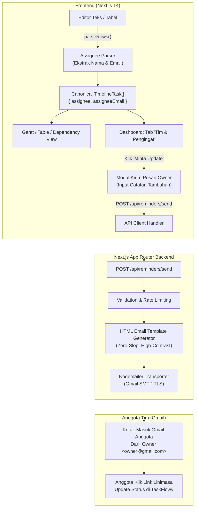

# SPEC: Gmail Team Reminders & Collaborative Workspace Dashboard

**Date:** 2026-09-06  
**Status:** Approved for Implementation  
**Project:** TaskFlowy (Text-to-Gantt)  
**Spec Path:** `docs/superpowers/specs/2026-09-06-gmail-team-reminder-design.md`  
**Plan Reference:** `docs/agy-plan/agy-plan-8.md`

---

## 1. Executive Summary & Objective

TaskFlowy saat ini unggul sebagai alat perencanaan linimasa *local-first* instan. Namun, ketika linimasa dibagikan ke tim kerja, pemilik proyek (*Project Owner*) kesulitan memastikan anggota mengeksekusi tugas sesuai tenggat waktu tanpa harus menanyakan status secara manual satu per satu lewat chat.

Fitur **Gmail Team Reminders & Collaborative Dashboard** menghadirkan:
1. **Ekspansi Syntax Parser**: Deteksi otomatis nama dan alamat Gmail anggota langsung dari baris teks bebas (contoh: `Desain Wireframe | Siti <siti@gmail.com> | 10 Sep | 3 hari`).
2. **Tab Baru Dashboard: "Tim & Pengingat" (`Team & Reminders`)**: Tempat terpusat bagi pemilik proyek untuk melihat daftar anggota tim, email mereka, beban tugas, dan memicu pengiriman email permintaan update/reminder secara instan.
3. **Transport Email Gratis & Terpercaya via Nodemailer & Gmail SMTP**: Pengiriman email dilakukan langsung mengatasnamakan pemilik proyek melalui Gmail SMTP (gratis 500 email/hari, tanpa perlu membeli domain DNS).
4. **Endpoint Cron Penjadwalan Otomatis**: Endpoint `/api/reminders/cron` untuk integrasi cron otomatis H-1 sebelum deadline.

---

## 2. Arsitektur Komponen & Alur Data



---

## 3. Detail Spesifikasi Teknis

### 3.1. Syntax Grammar & Ekstrak Email
Parser mengenali format nama dan email standar pada kolom PIC/Assignee:
- `Nama <email@domain.com>`
- `Nama (email@domain.com)`
- `email@domain.com` (nama otomatis diset dari username email)
- `@Nama` (format reguler tanpa email)

Contoh input yang valid:
```text
Desain Mockup | Budi <budi@gmail.com> | 10 Sep | 3 hari
Review API | Siti (siti@gmail.com) | after Desain Mockup | 2 hari
Deployment Server | devops@company.com | 15 Sep | 1 hari
```

### 3.2. Data Model Extensions
Perluasan tipe pada `frontend/src/lib/schema.ts`:
```typescript
export interface TimelineTask {
  id: string
  name: string
  assignee: string | null
  assigneeEmail?: string | null // NEW: Alamat email terverifikasi
  start: string
  end: string
  durationDays: number
  dependsOn?: string | null
  progress?: number
  ambiguities: string[]
  isCritical?: boolean
  isMilestone?: boolean
}

export interface ReminderNotificationLog {
  id: string
  taskId: string
  taskName: string
  recipientName: string
  recipientEmail: string
  sentAt: string
  status: 'sent' | 'failed'
  messageId?: string
  error?: string
}
```

### 3.3. Email Transport & Environment Config
Konfigurasi file `.env.local` pada `frontend/`:
```env
# Gmail SMTP Configuration (100% Free via Google App Password)
GMAIL_USER=your-email@gmail.com
GMAIL_APP_PASSWORD=xxxx xxxx xxxx xxxx

# Opsional: Secret key untuk trigger cron job
CRON_SECRET=taskflowy-secret-cron-token
```

Jika kredensial belum diisi di `.env.local`, sistem secara cerdas menampilkan panduan bantuan interaktif di UI dan fallback ke format *mailto / Gmail compose link* instan agar tidak memblokir workflow pengguna.

### 3.4. Template Email (Standar Anti-Slop & Human-Readable)
- Subjek: `[TaskFlowy] Pengingat Tugas: "{taskName}" dari {ownerName}`
- Header: Nama Proyek & Tanggal Deadline tebal dan kontras.
- Badan:
  - Sisa hari kerja (countdown).
  - Status pengerjaan saat ini.
  - Catatan khusus dari Project Owner.
  - Tombol aksi utama (CTA): "Buka & Perbarui Linimasa di TaskFlowy" (menuju hash URL proyek).
- Footer: Identitas `TaskFlowy | Free & Open Productivity` tanpa tracking pixel atau spambot headers.

---

## 4. Rencana Verifikasi & Uji Kualitas

1. **Unit Test Parser Email**:
   - Uji ekstraksi format `<email>`, `(email)`, dan email murni.
   - Verifikasi preservasi nama PIC tanpa tanda kurung/kurung siku.
2. **API Endpoint Test**:
   - Mock test payload ke `/api/reminders/send`.
   - Validasi error handling jika email tidak valid atau kredensial SMTP kosong.
3. **UI & Keyboard Navigation Test**:
   - Verifikasi modal "Kirim Reminder" dapat dibuka dan ditutup dengan tombol `Escape`.
   - Verifikasi feedback status pengiriman (loading, sukses, error) tampil ramah di tab dashboard.
4. **Anti-Slop Delivery Gate**:
   - Memastikan nol em dash (`—`), kontras rasio WCAG AA, dan konsistensi tombol `rounded-md`.
